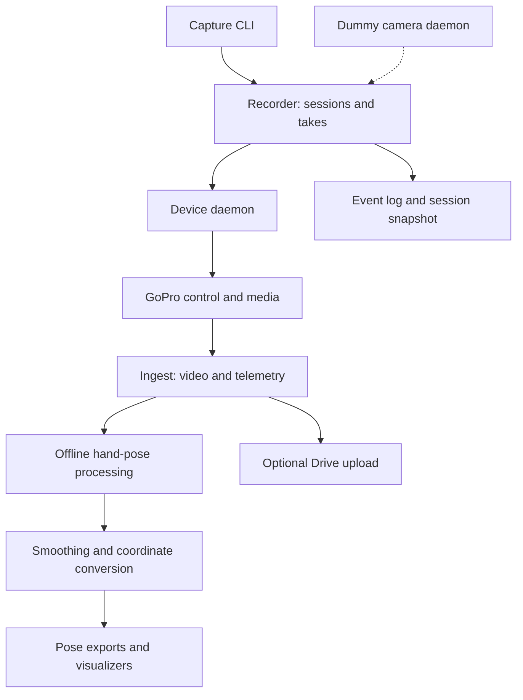

# Egocentric Capture & Hand Tracking

**Turn recordings from head- and wrist-mounted cameras into organized sessions,
hand-pose data, and visualizations.**

Built by **Jackie Oliver** at Haptica, January–February 2026. I built the capture
and processing integration: device control, session orchestration, recording
storage, telemetry extraction, tracking-output conversion, and visualization.
The system integrates GoPro interfaces, Apple Vision, and upstream HaMeR/Dyn-HaMR
and MANO models; those models are separate work, not models trained from scratch here.

**Stack:** Python · Swift/Apple Vision · BLE/HTTP/Unix sockets · Flask/OpenCV ·
JSONL/SQLite · PyTorch-based offline tooling

This is a code-only snapshot. Development history is not carried into this edition. Recordings, device
credentials, camera configuration, test media, and model assets are excluded.

## The system at a glance



These are separate tools and stages, not one automatically orchestrated command.
The wired Flask/OpenCV viewer is an additional direct-camera development path.

## Engineering decisions and logic

| Problem | Approach |
| --- | --- |
| Device protocols should not spread through recording logic. | The session recorder talks to a daemon over a Unix socket. GoPro-specific control lives behind that interface; a dummy daemon supports exercising the same recording flow without cameras. |
| A video file alone does not explain which session, take, or device produced it. | Session/take identifiers, device snapshots, and append-only JSONL events connect media to the capture process. `session.json` provides the current snapshot, and SQLite supports indexing. |
| Camera control and file availability are different events. | Recordings move through pending, linked, ingested, and verified states. The recorder resolves a recording to the camera's media entry before later stages retrieve it. |
| Live feedback and high-quality offline processing need different paths. | Apple Vision supports local preview/landmark processing; the offline tooling consumes HaMeR/Dyn-HaMR outputs for 3D hand processing and rendering. |
| Noisy estimates and coordinate mismatches spoil otherwise useful tracking. | The repository includes an RTS smoothing workflow, conversion/export tools, and skeleton/mesh rendering for inspecting alignment. The smoothing code uses observations before and after a frame, making it an offline step. |
| Field capture should not depend on immediate cloud upload. | Session state and media live locally. Drive registry/upload tools are a separate integration with their own OAuth configuration. |

The table summarizes the implemented structure and its
engineering rationale; it does not assert that every stage has been validated on
every camera or platform.

## Where to read the code

- [recording/recorder.py](recording/recorder.py): device selection, session creation, and take lifecycle.
- [recording/store.py](recording/store.py): events, session snapshots, and indexing.
- [gopro/gopro_daemon.py](gopro/gopro_daemon.py): camera control and media resolution.
- [dummy_camera/dummy_daemon.py](dummy_camera/dummy_daemon.py): hardware-independent recording counterpart.
- [vision-detector](vision-detector): Swift capture, landmarks, and overlays.
- [RTS smoothing](dyn_hamr_bundle/scripts/03_smooth_params.py).
- [scripts/skeleton/hand_pipeline.py](scripts/skeleton/hand_pipeline.py): pose loading, joint/mesh rendering, exports, and multi-view alignment tools.
- [scripts/rerun_visualizer.py](scripts/rerun_visualizer.py): multi-camera video and IMU telemetry inspection.

## Start with the capture tools

The declared environment is Python 3.11; the dependency list includes Apple's
Vision bridge, so the base installation is intended for macOS. Offline model
processing has a separate GPU/environment setup.

```sh
uv python install 3.11
uv sync
uv run gopro --help
uv run transcriptions --help
```

The recording-flow test starts two dummy cameras, creates a session, starts and
stops a take, then checks the resulting recording links and event log:

```sh
uv run python -m unittest discover -s tests -p 'test_recording_cli_dummy.py' -v
```

No camera or cloud credentials are needed for that test. It does not validate
physical camera timing, tracking accuracy, or Drive uploads.

For USB camera development, [web/wired_server.py](web/wired_server.py) provides a
Flask/OpenCV GUI. The old React/FastAPI recorder UI is not present in this snapshot.

## Development progression

The original Haptica commit history records the progression from capture to
tracking and inspection:

- **January 16–17:** capture/provisioning and session tooling; the React/FastAPI
  interface was removed while keeping the CLI core, and a wired-camera GUI followed.
- **January 19–early February:** Dyn-HaMR processing/smoothing tools and overlays;
  Rerun visualization added multi-camera video and IMU telemetry.
- **February 2–4:** skeleton coordinate-alignment corrections, lens-distortion tools,
  data export, and interactive rendering/inspection work.

This overview describes capabilities represented in this public snapshot. Later
private-branch experiments are not implied to be included.

## Limits and further reading

Model checkpoints and MANO assets require separate setup and applicable upstream
terms. Some offline scripts use example model paths that must be
adapted. Vendored Dyn-HaMR code is excluded; use the upstream project and its terms. A fresh clone is not a turnkey GPU inference environment, and this
repository does not establish a numerical tracking-accuracy benchmark.

On October 6, 2026, two session-storage tests and the dummy-camera recording-flow
test passed in an isolated Python 3.11 environment with their required dependencies.
The full GPU environment was not installed. No current physical-camera or GPU
end-to-end result is claimed by this documentation pass.

See [publication scope](PUBLICATION.md) for exclusions and attribution.

The GoPro GPMF parser is an upstream submodule listed in [.gitmodules](.gitmodules).
Upstream libraries, models, and their attribution remain separate from my capture
and integration work.
